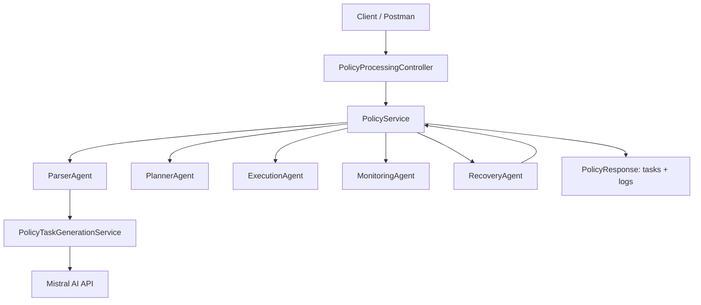

# AI Multi-Agent Policy Execution System

### 1. Overview
This system converts a policy text into structured tasks, simulates execution, detects failures, and applies recovery actions while producing an audit log. It is implemented as a Spring Boot REST API with a sequential, agent-based workflow orchestrated by a service layer.
### 2. High-Level Diagram

**Figure: Multi-agent workflow showing policy processing, execution, monitoring, and recovery loop.**

### 3. Technical Flow (Implementation View)

### 4. Communication Flow (Sequence)
1. Client calls `POST /api/process-policy` with `policyText`.
2. `PolicyProcessingController` validates input and delegates to `PolicyService`.
3. `PolicyService` orchestrates the agents in order:
   - `ParserAgent` extracts tasks using `PolicyTaskGenerationService` (LLM call).
   - `PlannerAgent` applies default status (`PENDING`) if missing.
   - `ExecutionAgent` simulates execution (marks all tasks `COMPLETED`, then randomly one `FAILED`).
   - `MonitoringAgent` detects tasks with status `FAILED`.
   - `RecoveryAgent` updates failed tasks and returns recovery logs.
4. `PolicyService` aggregates logs and returns `PolicyResponse`.

### 5. Agent Roles (Implementation-Aligned)
- **ParserAgent**
  - Input: raw `policyText`.
  - Calls `PolicyTaskGenerationService` which queries the Mistral API.
  - Parses JSON output into `List<TaskResponse>`.
  - Returns empty list when the LLM response is blank.

- **PlannerAgent**
  - Adds default `status = "PENDING"` to tasks that do not have a status.

- **ExecutionAgent**
  - Simulates execution by setting all tasks to `COMPLETED`.
  - Randomly selects one task and sets it to `FAILED` (demo behavior).

- **MonitoringAgent**
  - Detects tasks with status `FAILED`.
  - Returns a list of failed tasks (current implementation does not score risk).

- **RecoveryAgent**
  - For each failed task, updates `status = "REASSIGNED"`.
  - If role is missing, sets role to `UNASSIGNED` and logs reassignment.
  - Otherwise extends deadline (appends `" (extended)"`) and logs the change.

### 6. Tool Integrations
- **Mistral AI API**
  - Used by `PolicyTaskGenerationService` via `RestTemplate`.
  - Endpoint: `https://api.mistral.ai/v1/chat/completions`.
  - Requires `spring.ai.mistralai.api-key` or `MISTRAL_API_KEY`.

- **Jackson ObjectMapper**
  - Converts LLM JSON output into `TaskResponse` DTOs.

### 7. Error Handling and Recovery Logic
- **Controller-level**
  - Catches unexpected exceptions and returns HTTP 500 with a minimal error log.

- **Parser-level**
  - If LLM response is blank, returns an empty list.
  - If JSON parsing fails, throws `IllegalStateException`, which is caught by `PolicyService`.

- **Service-level**
  - `PolicyService` catches parsing exceptions, logs the error, and continues with empty tasks.
  - Recovery logs are appended to the overall log list and returned with the final response.

### 8. Data Contracts (DTOs)
- **PolicyRequest**
  - `policyText: String`

- **TaskResponse**
  - `taskName: String`
  - `role: String`
  - `deadline: String`
  - `priority: String`
  - `status: String`

- **PolicyResponse**
  - `tasks: List<TaskResponse>`
  - `logs: List<String>`

### 9. Notes and Assumptions
- The system is intentionally demo-oriented (random failures) to illustrate agent recovery.
- Monitoring currently focuses only on failed tasks and does not flag risk or delay.
- Planner currently only sets default status; task enrichment beyond status is handled by the LLM.

### 10. Conclusion

This architecture demonstrates a fully autonomous multi-agent system capable of executing enterprise workflows end-to-end, including failure detection and self-recovery. The design ensures scalability, auditability, and real-world applicability.
